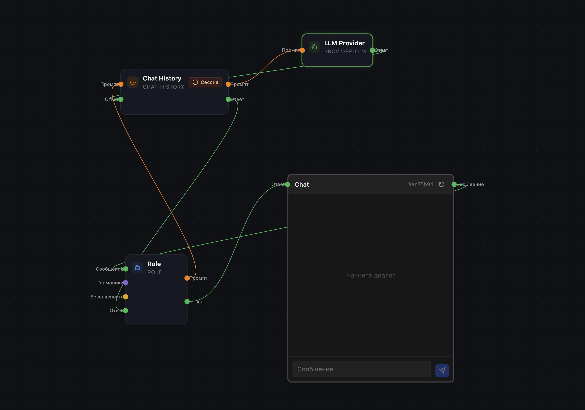
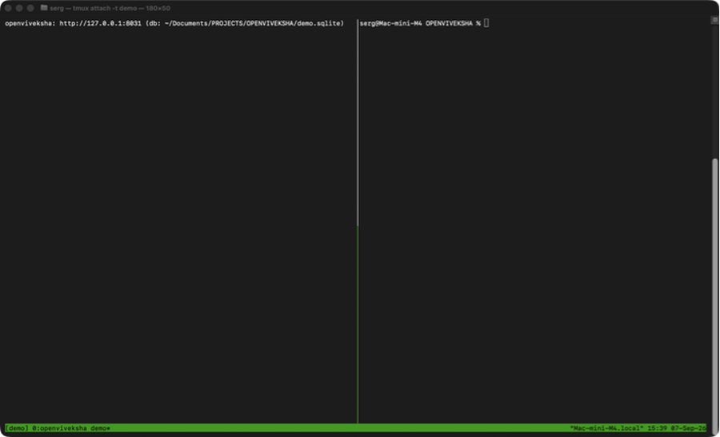

# OpenViveksha

**AI can program AI agents.**

OpenViveksha is a minimal open agent runtime where the *programmer* is an AI
client. OpenCode, Claude Code, or any MCP host builds an executable agent
system — nodes, wires, validation, runs, tests — through a local MCP server.
No SaaS. No cloud. One SQLite file.

<p align="center">
  
</p>

<p align="center"><sub>A minimal agent canvas — screenshot from the Viveksha PRO canvas UI
(the commercial edition). OpenViveksha itself is headless: the same graph is
built and run through MCP or the local HTTP API.</sub></p>

```text
YOU (or your AI client):        "Build an agent that digests this repo's
                                 changelog into a weekly post."
OpenCode / Claude Code:         list_nodes → create_node ×6 → create_edge ×5
                                validate_canvas → run_canvas
Result:                         a working agent, one SQLite file away.
```

<p align="center">
  
</p>

<p align="center"><sub>Live demo: an MCP client assembles the agent (canvas → 4 nodes → 5 wires →
validation), then the runtime executes it — the trace shows every node with
timings and tokens. Model: <code>qwen3.8:27b</code> on a local Ollama box. No SaaS. No cloud.
Start the runtime with <code>serve --verbose</code> to watch your own runs like this.</sub></p>

We proved it the hard way first: a production news site is maintained by an
agent that an AI client assembled through this exact MCP workflow — nodes,
wires, validation, runs — on a live schedule.

> **Why OpenViveksha?** This project has an origin story: a founder who
deliberately avoided other builders, hit the wall of monoliths and hardcode,
wrote testable execution laws out of battle scars — and arrived at a paradigm
where *an intention has no face*.

➡️ Read the full story: [The Path of Viveksha](docs/project-history.md) ·
🇷🇺 Russian original: [Путь Вивекши](https://news.viveksha.ru/put-vivekshi-paradigma-ii-agentov/)

- **Spec-first** — the canvas is a *language*: `spec/nodes.schema.json`
  (7 node types), `spec/canvas-spec.md` (file format), `spec/laws.md`
  (14 testable execution laws).
- **Local MCP** — 11 tools, from `create_canvas` and `create_node` to
  `validate_canvas` and `test_agent`. Everything an AI client needs to
  author, check, and run.
- **7 nodes**: `channel`, `chat`, `chat-history`, `role`, `provider-llm`,
  `tools`, `mcp`.
- **Zero cloud.** SQLite storage, localhost HTTP, stdio MCP.

## What you can build

OpenViveksha is not a concept or a demo — it is the runtime we use to run
production agents.

With the 7 built-in nodes, plus your own node modules, you can build:

- **Content pipelines** — an agent reads a source (changelog, RSS, a folder),
  processes it, and produces digests or articles on a schedule. Our production
  news site runs this way.
- **Assistants over your data** — expose your knowledge or business data
  through MCP tools and let the agent retrieve and use it when needed.
- **Chat agents** — put a webhook or another channel in front, connect chat
  history, and the runtime handles the conversation.
- **Scheduled jobs** — trigger the HTTP API from cron or another scheduler and
  let the agent perform the task and write the result.
- **Tool-using agents** — the execution laws handle the tool loop: when the
  model requests tools, the runtime executes them, feeds the results back,
  and continues until no further tool calls are requested.

The important part: these are not special-purpose features. They emerge from
the same canvas, nodes, connections, and execution laws — one runtime,
different forms of behavior. The executor tolerates any creation order and
graph shape.

Need a node we don't have? Ship it as a separate node module package —
extend the runtime without forking it. See *Writing your own nodes* below.

## Quickstart

```bash
git clone https://github.com/viveksha-ai/openviveksha && cd openviveksha
npm install && npm run build

# start the runtime (HTTP on 127.0.0.1:8031 + MCP on /mcp)
# add --verbose to watch every run execute: per-node trace with timings and tokens
node dist/cli.js serve --db ./agent.sqlite --verbose
```

### Let an AI client program it

Point your MCP host at the stdio server:

<details>
<summary>OpenCode — <code>.opencode.json</code></details>

```json
{
  "mcp": {
    "openviveksha": {
      "type": "local",
      "command": ["node", "/path/to/openviveksha/dist/cli.js", "mcp", "--db", "/path/to/agent.sqlite"]
    }
  }
}
```

</details>

<details>
<summary>Claude Code — <code>.mcp.json</code></details>

```json
{
  "mcpServers": {
    "openviveksha": {
      "command": "node",
      "args": ["/path/to/openviveksha/dist/cli.js", "mcp", "--db", "/path/to/agent.sqlite"]
    }
  }
}
```

</details>

Then just ask:

> Build an agent that takes a changelog file and writes a human-readable
> digest to digest.md. Create the nodes and wires with the MCP tools,
> validate the canvas, then run it with test_agent.

The client will call `list_nodes`, create the graph (`chat → role →
chat-history → provider-llm`, reply wired back), validate, run, and report.
See `examples/demo.mjs` for the same workflow as a deterministic script.

## The graph

```text
[channel webhook] ──message──▶ [role] ──prompt──▶ [tools] ──prompt──▶ [provider-llm]
                                     ▲                │  ▲             │
[mcp source] ──────tools─────────────┘                └── reply ──────┘
[chat] ◀──reply── (final answer, laws §10)
```

The agentic tool loop is not hardcoded — it *emerges* from the execution
laws: the `tools` node re-prompts, the executor's fixed point re-runs the
`llm`, and the graph stabilizes when the model stops calling tools.

## Trust boundary (read this)

v0.1 is a local, single-user runtime. **A canvas is code**: `mcp.command`
values and node configs are executed by your machine. The HTTP server binds
`127.0.0.1` unless you explicitly say otherwise. Secrets live as
`${ENV_NAME}` references, resolved at run start, and never re-enter API
responses or traces. Details: `spec/canvas-spec.md`, `SECURITY.md`.

## Writing your own nodes

A node is one object against a tiny contract (`src/types.ts`): a manifest, a
JSON-Schema `dataSchema`, typed ports (`TXT`, `PROMPT`, `TOOLS`, `ANY`), and
`execute(ctx)`. Register it, and AI clients can program with it immediately.
Your package, your license — see `TRADEMARKS.md` for naming rules.

## Project layout

```text
spec/                 the language: node registry, canvas format, laws, MCP contract
src/                  the runtime (TypeScript, Node 22+, SQLite)
src/nodes/            the 7 built-in node modules
examples/demo.mjs     deterministic demo: an MCP client builds an agent
```

## Links

- Website: **[viveksha.ru](https://viveksha.ru)** — the Viveksha PRO platform
- Documentation: **[viveksha.ru/docs](https://viveksha.ru/docs)**

## License & trademarks

Code: [Apache-2.0](LICENSE). The names OpenViveksha / Viveksha are trademarks
of the author and are not covered by the code license — [TRADEMARKS.md](TRADEMARKS.md).
Third-party nodes carry their own licenses; the runtime does not endorse them.

Viveksha PRO — the hosted commercial platform built by the same author —
shares the canvas idea, not this codebase: harmonics, resonance, cognitive
architecture, multi-tenancy, and integrations live there, not here.